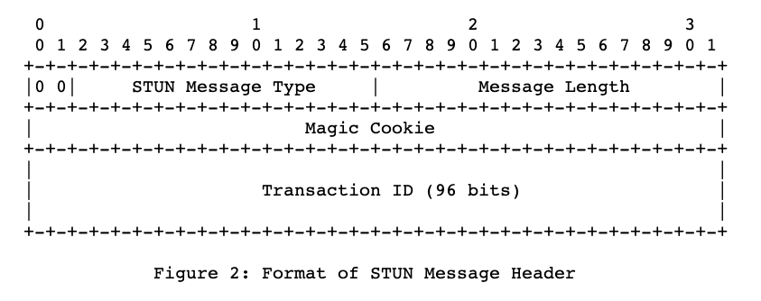
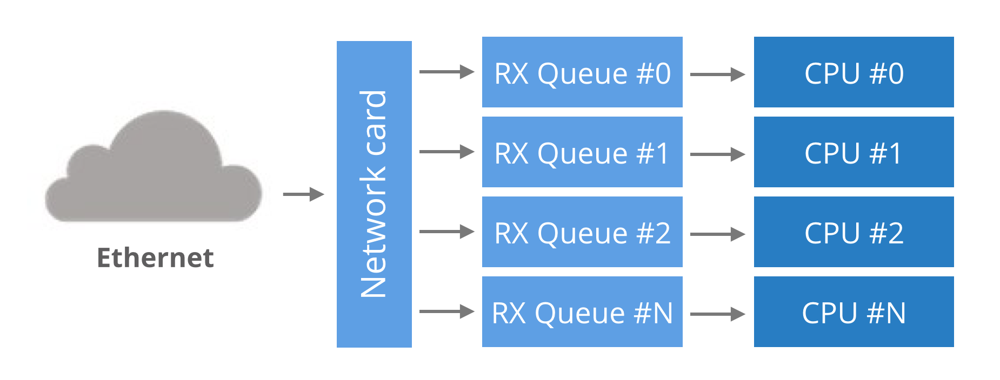

在webrtc技术栈里面，stun协议虽然不是非常的引人注目，但却是非常重要的一个部分，目前开源的stun服务器有c语言的实现coturn、cpp语言实现stunserver，他们实现了完整的stun协议，但是他们都是单线程的服务。在请求不高的情况下，他们都能很好的工作，但是在某些并发性非常高的场景，单线程的服务器马上就到瓶颈了。 

在直播场景中，为了节省服务器的带宽消耗，会用到webrtc的datachannel来支持用户之间p2p传输直播视频数据，由于直播场景实时性要求比较高，视频数据的时效性要求也很高，当一个用户打开某个直播间，技术上会要求它马上和同直播间的多个用户建立p2p的连接，并且要尽可能的快的完成建连，建连的过程需要并行执行，在1对1建连过程之前，两个用户都需要请求stun服务器来拿到自身网络NAT出口的公网ip和映射的端口号，假设一个用户同时和同直播间的12个用户建连，会对stun服务器产生12QPS的请求，假设一个直播间突然有了100w用户，这100w用户同时寻找任意的12个用户建连，那么stun服务器就会承受1200w QPS的请求。这个量无疑非常巨大的，好在直播间的用户进入是一个渐进的过程，并且一个用户连满了12用户之后就并不会再进行p2p建连过程，直到其中有人离开，所以真实的场景不会如假设的情况这般夸张。随着业务的发展，直播间同时在线可能会达到1000万人，如何支撑1000万人的直播间p2p快速建连，并开始视频数据传输，对stun服务服务器性能是个很大的考验。

在阐述stun服务器性能优化之前，本文先对stun协议的RFC5389版本进行一个简单的介绍，之后具体展开如何优化服务性能。
## stun 协议
stun协议的全称（Session Traversal Utilities for NAT ）是为其他协议处理NAT穿越的一个工具协议。
### stun message
所有的STUN meesage都以20字节定长的header开头，接着跟着0个或者多个属性（Attribute），STUN header包含message type、magic cookie、 transaction ID和message length。




如图，
1. 前两个bit必须为0,如果和其他协议共用端口，前两个bit可以用于区分出stun message；
2. message type 定义了四种类型消息分别是(request, success response, failure response, indication);
3. magic cookie 必须是一个固定的值 0x2112A442，可以用于区分出是否为stun message;
4. transaction ID 是一个96-bit的id,服务端和客户端都可以用这个唯一的id来区分每个请求事务;
5. message length 表示这个包（除了header）的大小;
6. 跟在header后面的是0个或者多个属性（attributes）。

stun message协议解码和编码已经有开源库实现比如:[stun](https://github.com/webrtc-rs/stun),我们可以直接通过rust的依赖包管理功能来获取。 

了解了stun的协议，我们就清楚了我们stun服务器的主要工作：
1. 接受一个udp消息，这个消息小于MTU;
2. 把接收到的数据解码为一个stun binding request;
3. 通过udp协议我们拿到这个请求的src ip 、port,并创建一个stun message 类型为success binding response,把取到的src ip port 添加到这个message的attribute中；
4. 把response编码序列化之后通过系统发送给请求方。

利用上面提到第三方库我们可以很快的写出服务端解析请求数据包得到stun message结构体,如果解析成功我们会得到一个Message的实例，把这个message 的类型改成 BINDING_SUCCESS,并添加XorMappedAddress，重新序列化后得到一个返回值，如果不成功我们返回None。stun message的请求响应处理rust实现如下：
Cargo.toml文件新增依赖包`stun = "0.4.1"`;
```rust
use std::net::SocketAddr;
use stun::message::*;
use stun::xoraddr::*;
use nix::sys::socket::SockAddr;

fn process_stun_request(src_addr: SockAddr, buf: Vec<u8>) -> Option<Message> {
    let mut msg = Message::new();
    msg.raw = buf;
    if msg.decode().is_err() {
        return None;
    }
    if msg.typ != BINDING_REQUEST {
        return None;
    }
    match src_addr.to_string().parse::<SocketAddr>() {
        Err(_) => return None,
        Ok(src_skt_addr) => {
            let xoraddr = XorMappedAddress {
                ip: src_skt_addr.ip(),
                port: src_skt_addr.port(),
            };
            msg.typ = BINDING_SUCCESS;
            msg.write_header();
            match xoraddr.add_to(&mut msg) {
                Err(_) => None,
                Ok(_) => Some(msg),
            }
        }
    }
}
```
接下来我们通过rust nix第三库来调用系统函数,nix是对libc函数库的一个上层封装，封装了所有通过FFI调用libc的unsafe的函数，并提供友好的API，我们需要它创建socket，调用recvmsg、sendmsg、recvmmsg、sendmmsg等系统函数。我们先通过recvmsg和sendmsg先实现一个单线程的stun服务器，rust代码如下所示:
Cargo.toml新增依赖包`nix = "0.23.0"`
```rust
// use ...
use nix::sys::socket::{
    self, sockopt, AddressFamily, InetAddr, MsgFlags, SockFlag, SockType,
};

fn main() {
    let inet_addr = InetAddr::new(IpAddr::new_v4(0, 0, 0, 0), 3478);
    run_single_thread(inet_addr)
}

pub fn run_single_thread(inet_addr: InetAddr) {
    let skt_addr = SockAddr::new_inet(inet_addr);
    let skt = socket::socket(
        AddressFamily::Inet,
        SockType::Datagram,
        SockFlag::empty(),
        None,
    )
    .unwrap();
    socket::bind(skt, &skt_addr).unwrap();
    let mut buf = [0u8; 50];
    loop {
        match socket::recvfrom(skt, &mut buf) {
            Err(_) => {}
            Ok((len, src_addr_op)) => match src_addr_op {
                None => {}
                Some(src_addr) => {
                    if let Some(msg) = process_stun_request(src_addr, buf[..len].to_vec()) {
                        _ = socket::sendto(skt, &msg.raw, &src_addr, MsgFlags::empty());
                    }
                }
            },
        }
    }
}
```
通过上面的代码，我们用rust实现了一个单线程的stun服务器，运行起来效果还不错。 接下来我们考虑如何利用起系统的所有cpu，这样能最大的开发出机器的性能。 

## 多线程服务器实现
在进入rust多线程编程之前，我们先了解一下计算机的网卡
### 网卡多队列
起初，网卡只有一个单一的读写队列用来在硬件和操作系统内核之间传输数据包，这样的设计有个缺陷，数据包的传送能力受限于一个CPU的处理能力。为了支持多核的系统，网卡都开始支持多个读写队列,如果把每个RX队列绑定系统中的各个CPU上,所有的CPU核心都能利用起来从网卡读写数据，通常数据包根据一定的hash算法把数据包分配给特定的队列，一般根据（src ip、dst ip、src port、dst port）四元组来计算哈希值，这保证了对于一个数据流的数据发送和接受都是在同一个RX队列里面，由同一个cpu处理，数据包的乱序也不会发生。



多队列和绑核能明显提升应用程序从网卡收发数据的速度，通过脚本[set_irq_affinity.sh](https://gist.github.com/SaveTheRbtz/8875474)或者安装irqbalance来把多个队列绑定到具体的cpu上,其中的原理就是相应队列的中断号绑定到具体的cpu序号上。

做完以上工作，我们可以开始编写多线程的程序，很快我们会遇到一个问题，操作系统拒绝多个线程开启同一个相同的端口，不过幸运的是，Linux kernel3.9带来了SO_REUSEPORT特性。
### SO_REUSEPORT
SO_REUSEPORT是一个socket的选项，我们设置这个选项为true，操作系统就会允许多个进程或者线程绑定一个相同的PORT，通常这么做有利于提高服务的性能，它包含了以下特性:
- 允许多个socket bind同一个TCP/UDP端口；
- 每个线程可以拥有自己的socket，多线程使用socket不再有锁竞争；
- 系统内核层面实现了负载均衡；
- 为了安全监听同一个端口的socket只能位于同一个用户下；

在代码层面我们要做两处改动，编码之前我们新增依赖包`num_cpus= "1.13.0"`来获取系统cpu个数，以便知道要开启几个线程，具体的改动如下：
1. main函数先获取系统cpu的数量，然后创建出同样数量的子线程去在各自的线程下打开相同端口的socket，持续循环收发消息。
```rust
fn main() {
    let inet_addr = InetAddr::new(IpAddr::new_v4(0, 0, 0, 0), 3478);
    let cpu_num = num_cpus::get();
    let mut i = 1;
    while i <= cpu_num {
        let inet_addr_n = inet_addr.clone();
        thread::spawn(move || run_reuse_port(inet_addr_n));
        i += 1;
    }
    run_reuse_port(inet_addr)
}
```

2. 在每个线程下的socket添加ReusePort选项 
在原有run_single_thread方法中在socket::bind方法之前，我们添加setsokcetopt一行，设置ReusePort选项设置为true，并把方法重新命名为run_reuse_port。
```rust
pub fn run_reuse_port(inet_addr: InetAddr) {
    ...
    socket::setsockopt(skt, sockopt::ReusePort, &true).unwrap();
    socket::bind(skt, &skt_addr).unwrap();
    ...
}
```
一个多线程的stun服务器就完成了。 `cargo run`一下，感觉良好，用测试程序给服务请求，很快我们可以看到机器上所有的CPU都开始工作了。 

## Linux独有的API recvmmsg 和 sendmmsg
通过上面的步骤，我们已经将单线程的服务改成了多线程，极大的提高了服务器的性能，后面我们继续使用linux的独有的系统API，sendmmsg和recvmmsg 再把服务器性能提高30%。

1. recvmmsg()系统调用是recvmsg的扩展，他允许调用方通过一次系统调用接受到多条消息，支持设置超时时间和每批次接受消息的数量。在实际的使用中每一批次接受的消息数量vlen需要根据业务的实际情况调整，一般我们使用阻塞的方式来使用recvmmsg，意味着当实际收到的包的数量等于vlen的时候，才会返回结果，有些业务在一天当中有高峰低谷，如果在低峰期请求数量长时间没达到vlen，recvmmsg会一直阻塞者等待，客户端就会长时间收不到响应消息，显然这种情况是不可接受的，幸好，recvmmsg支持设置超时时间，我们可以设置超时时间100ms 如果超过超时时间实际接受到的消息数量没达到设置的vlen，那么返回当前已经获取到的消息，这个超时时间不能设置的太小，否则cpu的占用会非常高，具体的vlen值和超时时间，需要根据具体的业务测试寻找到一个比较平衡的值。以上是在实际开发和压测过程中得出来的经验。

2. sendmmsg()也是一样的原理通过减少系统调用的次数来降低cpu的使用率，从而提高应用发送数据包的性能。

实际实现的代码如下：
```rust
#[cfg(any(target_os = "linux"))]
use nix::sys::socket::{RecvMmsgData, SendMmsgData};
use nix::sys::time::TimeSpec;
use nix::sys::uio::IoVec;
use std::iter::zip;
use std::time::Duration;

#[cfg(any(target_os = "linux"))]
pub fn run_reuse_port_recv_send_mmsg(inet_addr: InetAddr) {
    let skt_addr = SockAddr::new_inet(inet_addr);
    let skt = socket::socket(
        AddressFamily::Inet,
        SockType::Datagram,
        SockFlag::empty(),
        None,
    )
    .unwrap();
    socket::setsockopt(skt, sockopt::ReusePort, &true).unwrap();
    socket::bind(skt, &skt_addr).unwrap();
    loop {
        let mut recv_msg_list = std::collections::LinkedList::new();
        let mut receive_buffers = [[0u8; 32]; 1000];
        let iovs: Vec<_> = receive_buffers
            .iter_mut()
            .map(|buf| [IoVec::from_mut_slice(&mut buf[..])])
            .collect();
        for iov in &iovs {
            recv_msg_list.push_back(RecvMmsgData {
                iov,
                cmsg_buffer: None,
            })
        }

        let time_spec = TimeSpec::from_duration(Duration::from_millis(100));
        let requests_result =
            socket::recvmmsg(skt, &mut recv_msg_list, MsgFlags::empty(), Some(time_spec));

        match requests_result {
            Err(_) => {}
            Ok(requests) => {
                let mut msgs = Vec::new();
                let mut src_addr_vec = Vec::new();

                for recv_msg in requests {
                    src_addr_vec.push(recv_msg.address)
                }
                for (buf, src_addr_opt) in zip(receive_buffers, src_addr_vec) {
                    match src_addr_opt {
                        None => {}
                        Some(src_addr) => {
                            if let Some(msg) = process_stun_request(src_addr, buf.to_vec()) {
                                msgs.push((msg.raw, src_addr_opt));
                            }
                        }
                    }
                }

                let mut send_msg_list = std::collections::LinkedList::new();
                let send_data: Vec<_> = msgs
                    .iter()
                    .map(|(buf, src_addr)| {
                        let iov = [IoVec::from_slice(&buf[..])];
                        let addr = *src_addr;
                        (iov, addr)
                    })
                    .collect();

                for (iov, addrx) in send_data {
                    let send_msg = SendMmsgData {
                        iov,
                        cmsgs: &[],
                        addr: addrx,
                        _lt: Default::default(),
                    };
                    send_msg_list.push_back(send_msg);
                }
                _ = socket::sendmmsg(skt, send_msg_list.iter(), MsgFlags::empty());
            }
        }
    }
}

```

## 总结

1. 使用多线程和网卡多队列绑核的特性能够显著得提高服务器性能；
2. 使用linux sendmmsg 和recvmmsg 可以提高很大的性能，批量收取的消息量vlen需要根据各个业务的时机情况去设置，并且加上合理的超时时间，这才能发挥这两个recvmmsg的最大功效；
3. rust是一门性能非常优秀，开发工具十分完善，语法设计十分优雅的语言，值得投入。 